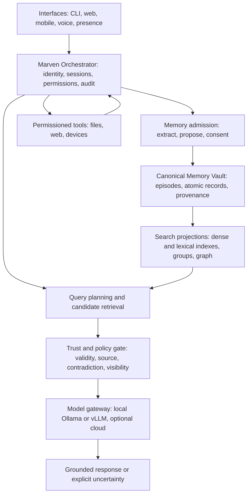

# Marven

> A Heshware personal sovereign AI research project for local-first, long-term human–AI collaboration.

[Heshware](https://heshware.it.com) is developing Marven as an AI collaborator that can preserve user-approved context, support reflection and growth, work across text and voice, and eventually maintain a persistent digital presence. Marven is designed so that the language model is a replaceable reasoning component—not the owner of identity, memory, permissions, or truth.

This public repository contains working local prototypes and research experiments. It is not the complete mobile product, a hosted service, or a production security boundary.

## What makes Marven different

- **Local-first and user-controlled:** local inference and storage are the default direction; remote services must be deliberately configured.
- **Persistent but governed memory:** retained information should pass through consent, provenance, validity, and policy checks before it can influence a response.
- **Model-agnostic orchestration:** Heshware-controlled services own identity, memory, retrieval, tools, permissions, and audit records while local or cloud models can be exchanged behind a gateway.
- **Interpretable retrieval:** indexes and graphs help find evidence, but the canonical memory record remains the source of truth.
- **Human oversight:** sensitive actions, durable memory writes, and system changes should be inspectable, reversible, and approval-gated.
- **Supportive—not clinical:** Marven may support reflection and self-improvement, but it is not a therapist, medical provider, or diagnostic system.

## Heshware Marven architecture

The long-term architecture separates conversation, memory governance, retrieval, model inference, and tools so that no single model call silently controls the system.



The orchestrator—not the selected model—remains responsible for deciding what context is eligible, which tools may run, what is written to long-term memory, and what evidence supports an answer.

## Memory and retrieval design

Marven's target memory pipeline is:

1. Preserve a raw episodic event with its source and access scope.
2. Extract one or more candidate memories without automatically accepting them as fact.
3. Apply admission rules for consent, provenance, duplication, sensitivity, and trust.
4. Store approved canonical records while retaining links to the original episode.
5. Build disposable search indexes and graph projections from canonical memory IDs.
6. Retrieve candidates, then apply validity, contradiction, supersession, visibility, and policy checks.
7. Give the model only eligible evidence, with enough metadata to cite it or state that the answer is unknown.

The first canonical schema is now implemented in SQLite. Records carry a stable memory ID, subject, content, type, source, source locator, creation time, validity interval, confidence, trust status, consent scope, visibility, episode group, lineage, supersession links, metadata, and deletion state. Legacy memory databases are migrated in place with conservative defaults.

### Two-stage retrieval

Marven is moving toward a two-stage retrieval design:

- **Candidate generation:** fast dense and lexical search over approved memories. The current prototype uses a lightweight SQLite memory store; FAISS or pgvector are candidate production backends.
- **Optional late-interaction reranking:** token-level representations and MaxSim-style comparison can recover precise details that a single-vector search may miss. ColBERT-style reranking is an active research direction, not a production dependency in this repository.

Reranking improves relevance. It does **not** prove that a memory is true, decide which belief is current, resolve contradictions, enforce consent, or propagate deletion. Those remain governance responsibilities after retrieval.

### Evidence graph and Brain Tour

The implemented evidence graph is an interpretable SQLite projection over canonical memory records. It connects subjects, tags, episodes, entities, sources, lineage, and supersession relationships while keeping traversal typed, bounded, and auditable. Retrieval returns its score components and best graph path. The graph may propose related evidence; it cannot silently rewrite canonical memory.

The Brain Tour can use the bounded graph API as a visualization and navigation layer over approved memory IDs and episode groups. The projection is regenerable from the canonical store rather than becoming a second, competing memory database. A graph neural network is not assumed; deterministic traversal must prove useful first. See [Canonical Memory and Evidence Graph](docs/MEMORY_GRAPH.md).

## What is implemented in this repository

| Area | Repository implementation | Maturity |
| --- | --- | --- |
| Text core | `marven.py`, `marven_cli.py`, and `marven_text_chat.py` | Working prototype |
| Local API | Flask endpoints for chat, streaming, health, file analysis, vision experiments, memory inspection, and local capabilities | Working prototype; interfaces may change |
| Web client | React chat UI with model selection, file, policy, proposal, and Brain Tour controls | Working prototype |
| Model backends | Ollama through LangChain plus an OpenAI-compatible local vLLM adapter | Experimental local inference |
| Memory | Canonical SQLite records, rebuildable vector and evidence-graph projections, governed graph-aware retrieval, MetaMirror/reflection experiments, and local archives | Working prototype; admission and evaluation remain experimental |
| Capability controls | Policy-checked file/network/device capabilities, audit records, and signed self-update proposals | Experimental; not a complete sandbox |
| Voice | Optional Vosk or Faster-Whisper ASR with interruptible local TTS | Separate prototype |
| Personalization | Ollama model helpers and a LoRA training script | Research tooling |
| Mobile and presence | React Native product architecture and persistent digital-human work | Heshware roadmap; not shipped here |

Legacy prompts, manifests, and experimental directives in the repository do not constitute production policy or safety guarantees.

## Repository map

- `marven.py` — response flow, local model routing, file-backed sessions, SQLite memory, retrieval, web commands, and reflection experiments.
- `server.py` — Flask API, streaming responses, vLLM integration, local capability endpoints, memory inspection, file analysis, and vision experiments.
- `marven_local/memory/` — canonical memory schema, migration, projection rebuilding, graph traversal, temporal gates, and explainable retrieval.
- `scripts/evaluate_longmemeval_retrieval.py` — local flat-versus-graph retrieval evaluation on LongMemEval data.
- `docs/MEMORY_GRAPH.md` — memory schema, graph model, API, benchmark mapping, and GNN adoption gate.
- `marven_local/` — capability policy, audit logging, plugins, learner experiments, and approval-based self-update workflow.
- `marven-react-app/` — local React chat interface.
- `marven-voice-interrupt-prototype_cpu_tuned/` — optional local ASR/TTS voice prototype.
- `marven-training/` — optional LoRA training experiments.
- `ollama/` — local Ollama model definitions and setup helpers.
- `tests/` — tests for capability, policy, and self-update behavior.
- `PRIVACY.md` — current privacy and data-handling expectations.
- `RUN_WINDOWS.md` — detailed Windows setup and run commands.

Runtime conversations, memory archives, audit logs, model weights, generated builds, private assets, and the `ShadowBox_Framework/` directory are intentionally excluded from the public repository. Review `.gitignore` and every staged file before publishing.

## Quick start

### Requirements

- Python 3.11 recommended (`pyproject.toml` currently declares Python 3.9 or newer)
- Node.js 18 or 20 LTS for the React client
- Ollama for the default local model path, or a separately configured local vLLM server

### Install the Python environment

```powershell
git clone https://github.com/ahesh001/Marven.git
cd Marven
py -3.11 -m venv .venv311
.\.venv311\Scripts\Activate.ps1
python -m pip install --upgrade pip
python -m pip install -e ".[test]"
python -m pip install langchain-ollama langchain langchain-community langchain-core flask flask-cors
```

The package metadata currently covers the local capability package and tests. The second install command adds the runtime libraries used by the text and Flask prototypes.

Start or download a local Ollama model:

```powershell
ollama run tinyllama
```

### Run text chat

```powershell
python marven_text_chat.py -s chat -m tinyllama
```

### Run the API and web client

Start the API from the repository root:

```powershell
python server.py
```

In another terminal:

```powershell
cd marven-react-app
npm ci
npm start
```

Open `http://localhost:3000`. The API listens on `http://127.0.0.1:8000` by default. Set `REACT_APP_API_BASE` if the API is hosted elsewhere.

For complete Windows commands, use [RUN_WINDOWS.md](RUN_WINDOWS.md). The voice prototype has its own [setup guide](marven-voice-interrupt-prototype_cpu_tuned/README.md).

## Configuration

| Variable | Purpose | Default |
| --- | --- | --- |
| `MARVEN_DEFAULT_MODEL` | Default Ollama model | `marven` |
| `MARVEN_CODE_MODEL` | Ollama model selected for `code:` prompts | `llama3:8b` |
| `MARVEN_CACHE_TTL` | Local response-cache lifetime in seconds | `30` |
| `VLLM_BASE_URL` | OpenAI-compatible local vLLM API | `http://127.0.0.1:8001/v1` |
| `VLLM_MODELS` | Comma-separated model IDs routed to vLLM | Empty |
| `REACT_APP_API_BASE` | React client's Marven API URL | `http://127.0.0.1:8000` |
| `MARVEN_BRAIN_BASE_URL` | Optional remote base URL for Brain Tour audio | Empty |

Do not commit environment files, credentials, private conversations, model caches, or user memory.

## Privacy, safety, and trust boundaries

Local-first does not automatically mean private or secure. Data can leave the machine if a remote model, web connector, speech service, proxy, or hosted asset endpoint is configured. Read [PRIVACY.md](PRIVACY.md) before using personal or confidential information.

The intended production boundary is deny-by-default and includes:

- treating external text, files, retrieval results, and tool output as untrusted input;
- validating and auditing durable memory writes;
- preserving source lineage and separating confirmed facts from plans, hypotheses, and disputed claims;
- applying least-privilege permissions to tools and agents;
- keeping service credentials outside clients and prompts;
- requiring explicit consent before optional cloud processing;
- propagating correction and deletion through indexes and graph projections; and
- preferring an explicit “unknown” over invented memory or unsupported certainty.

The present code is an experimental prototype. Review it before enabling file access, network access, microphones, cameras, self-update workflows, or sensitive data processing.

## Research roadmap

- Harden the memory-admission workflow so provenance, consent, sensitivity, and trust decisions are explicit before storage.
- Evaluate flat and graph-expanded retrieval on LongMemEval and Marven-specific update, temporal, privacy, and abstention cases.
- Add hybrid lexical/dense retrieval and optional late-interaction reranking against realistic queries and hard negatives.
- Build the Brain Tour visualization from the bounded graph API and canonical IDs.
- Consider a GNN only after deterministic baselines and labeled data show which node, edge, or path predictions are useful.
- Add evaluation for retrieval quality, contradiction handling, stale-memory rejection, privacy leakage, and abstention.
- Unify the local prototype with Marven's mobile, voice, and persistent-presence experiences behind the orchestrator.
- Keep self-improvement and personalization proposal-based, reviewable, and reversible.

## Responsible claims

Marven does not claim consciousness, literal self-awareness, access to hidden reasoning traces, mind-reading, emotional diagnosis, guaranteed accuracy, or automatic truth detection. Human-state signals are contextual cues, not medical conclusions. Retrieval scores and graph connections are evidence-selection aids, not proof.

## Contributing

Marven is early-stage research. Issues and focused pull requests are welcome, especially around memory schemas, retrieval evaluation, provenance, privacy, local inference, and permissioned tools. Do not submit private conversation data, credentials, proprietary model weights, or personal memory archives.

## License

Marven is released under the [MIT License](LICENSE). Third-party dependencies, services, datasets, and model weights retain their own licenses and terms.
