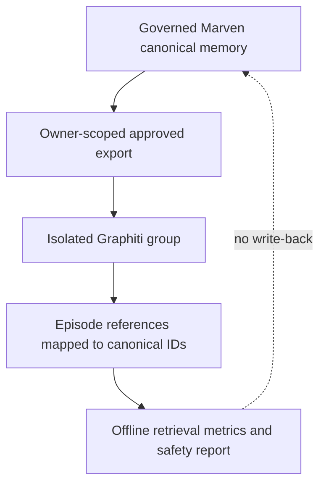

# Graphiti Evaluation Decision

**Status:** isolated evaluation harness implemented; comparative results pending
reviewed retrieval labels and an explicitly configured local evaluation stack.

**Assessed version:** [`graphiti-core==0.30.2`](https://github.com/getzep/graphiti/tree/v0.30.2),
reviewed September 21, 2026.

Marven should evaluate Graphiti as a derived retrieval system, not install it as
the owner of canonical memory. Graphiti builds a temporal context graph from
episodes using an LLM, embeddings, and a graph database. It may improve
multi-hop or time-sensitive retrieval, but those gains must be measured against
Marven's deterministic hybrid baseline under the same relevance judgments.

Graphiti is a knowledge/context-graph framework. It is **not** a graph neural
network (GNN), and adding it does not train graph weights.

## Architecture boundary

The experiment in [`experiments/graphiti/`](../experiments/graphiti/README.md)
enforces this one-way path. It loads only eligible records, creates a fresh
non-identifying group for each distinct captured agent/session and policy-filter
scope by default, disables raw episode storage and Graphiti telemetry, and
reports rankings by canonical ID. It has no code path that creates, edits,
confirms, supersedes, or deletes Marven memory.

## Marven and Graphiti

| Concern | Marven baseline | Graphiti experiment |
| --- | --- | --- |
| Source of truth | Owner-scoped SQLite canonical records | Derived context graph; never canonical |
| Admission | Explicit proposal, approval, consent, trust, and visibility fields | LLM extraction during episode ingestion |
| Time | Explicit validity intervals and supersession chains | Bi-temporal facts and automatic edge invalidation |
| Retrieval | Embedding + SQLite FTS5 + RRF + typed bounded traversal | Semantic + lexical + graph retrieval over extracted entities and facts |
| Provenance | Stable canonical IDs and field-level graph edges | Episode references that the harness maps back to canonical IDs |
| Infrastructure | Local SQLite; optional local embedding model | Python 3.10+, graph database, structured-output LLM, embedder, and reranker |
| Deletion | Tombstone plus projection and label-reference cleanup | Must be separately tested and explicitly propagated |
| Governance | Implemented in Marven's memory manager | Must remain outside Graphiti and wrap every import/export |

Graphiti's useful ideas for Marven are temporal facts, episode provenance,
entity/relationship retrieval, and hybrid graph search. Its extra extraction
layer also introduces failure modes: schema-invalid model output, incorrect
facts or entity merges, graph-database lifecycle risk, remote-provider
disclosure, and deletion drift. Those risks are why Graphiti remains isolated.

## Evaluation protocol

1. Collect graded judgments with
   `scripts/label_memory_retrieval.py`. Use `0` for irrelevant, `1` for
   marginal, `2` for relevant, and `3` for essential. Add relevant canonical
   IDs that the baseline missed.
2. Export plaintext-query runs with `scripts/export_retrieval_labels.py`.
   Hash-only runs are audit records and are excluded by default because they
   cannot reproduce a query.
3. Run both systems against the same query/judgment set. The saved report
   includes Recall, MRR, NDCG, judged precision, label coverage, ingestion
   time, query latency, and provenance failures. It excludes memory text.
4. Destroy the isolated graph database after the experiment unless its
   retention was separately approved. Extracted entities and facts may remain
   sensitive even when raw episode storage is disabled.

The harness recommends continued evaluation only when all initial gates pass:

- at least 50 labeled queries;
- at least 80% average judgment coverage of baseline results;
- NDCG gain of at least 0.05 at the largest requested cutoff;
- recall regression no worse than 0.02; and
- zero episode references that cannot be mapped to a scoped canonical ID.

Passing those gates is not approval for runtime integration. Before a runtime
proposal, Marven must also test tenant isolation, correction and deletion
propagation, adversarial extraction, temporal updates, abstention, failure
recovery, latency, resource use, and provider cost.

## Security and privacy controls

- The evaluator refuses non-loopback model and graph endpoints unless the
  operator deliberately supplies `--allow-remote-services` after reviewing
  consent and policy.
- `GRAPHITI_TELEMETRY_ENABLED=false` is set before Graphiti is imported.
- `store_raw_episode_content=False` prevents raw episode bodies from being
  retained by Graphiti, but extracted graph data can still disclose meaning.
- The Neo4j credentials and model settings remain environment configuration;
  they must never be committed.
- Retrieval labels and exports are sensitive local research data. Plaintext
  query capture is opt-in at the API; hash-only capture is available when
  reproducible query text is not required.

The Zep coding-agent integration described in Zep documentation may help an
agent look up Graphiti guidance. It is not required to run this harness, does
not add a GNN, and should not receive canonical Marven memory merely because it
is installed.

## Decision

Keep Marven's deterministic hybrid retrieval as the baseline and canonical
governance layer. Collect the label set first, then run the pinned Graphiti
experiment locally. Consider a narrower runtime proposal only if the measured
quality gain survives the safety, privacy, deletion, latency, and cost gates.

## Primary references

- [Graphiti repository](https://github.com/getzep/graphiti)
- [Graphiti v0.30.2 package metadata](https://github.com/getzep/graphiti/blob/v0.30.2/pyproject.toml)
- [Graphiti v0.30.2 core API](https://github.com/getzep/graphiti/blob/v0.30.2/graphiti_core/graphiti.py)
- [Graphiti documentation](https://help.getzep.com/graphiti)
