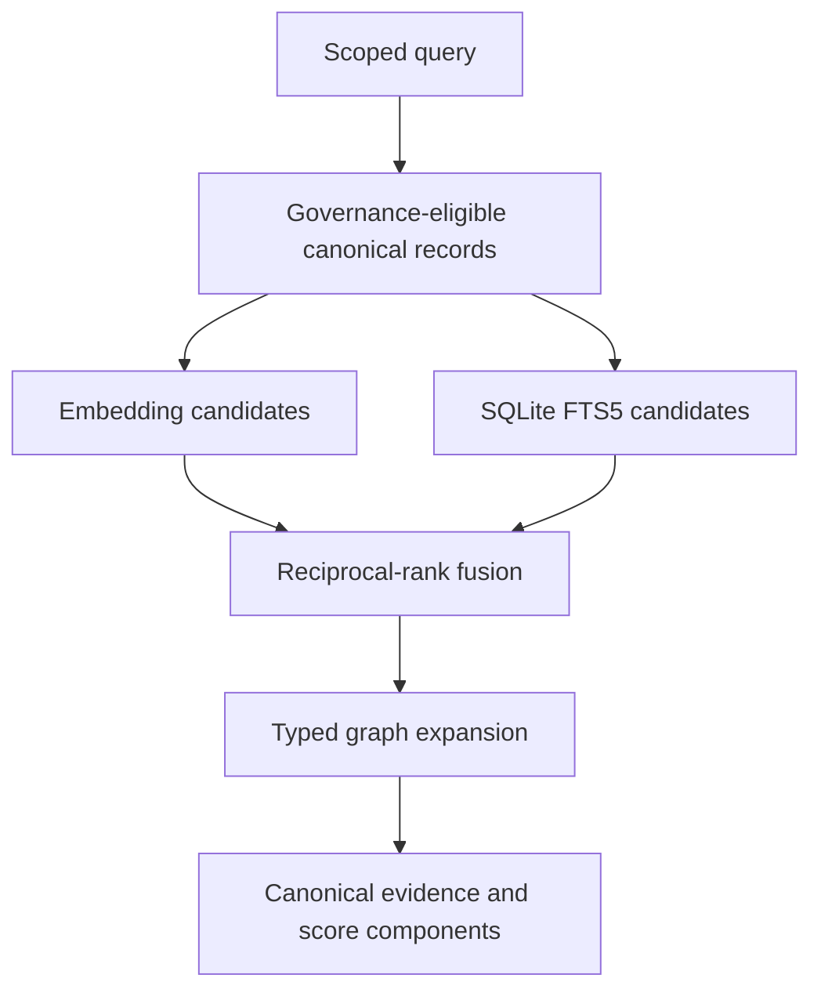

# Scoped Hybrid Memory Retrieval

Marven retrieves from disposable projections while keeping the canonical SQLite
record authoritative. Retrieval can rank evidence; it cannot confirm a claim,
change consent, supersede a record, or write a proposed memory automatically.

## Pipeline



The embedding and FTS5 searches produce independent candidate lists. Marven
unions those lists before ranking them with reciprocal-rank fusion (RRF). This
allows an exact identifier found by lexical search to survive even when its
embedding score is weak. The highest fused candidates seed bounded graph
expansion, which may add connected evidence from the same owner scope.

Each result reports:

- raw embedding similarity and embedding rank;
- normalized lexical contribution, FTS5 BM25 value, and lexical rank;
- fused RRF score;
- tag and canonical priority boosts;
- graph contribution and the selected graph path; and
- the embedding provider and whether lexical retrieval was available.

## Identity boundary

Every canonical record carries four identity fields:

| Field | Behavior |
| --- | --- |
| `workspace_id` | Required hard boundary for an installation, organization, or local vault |
| `owner_id` | Required hard boundary for one person's canonical memory |
| `agent_id` | Optional narrowing for the agent or persona that produced the record |
| `session_id` | Optional narrowing for a conversation, task, or run |

Search, graph inspection, deletion, supersession, hot-memory listing, and
proposal decisions always constrain `workspace_id` plus `owner_id`. Agent and
session filters can narrow that boundary further. Lineage and supersession
links cannot cross an owner boundary. Concept-node identifiers are salted with
the workspace and owner IDs, preventing a shared tag or entity name from
joining two owners' graph projections.

Legacy databases migrate to the configured local defaults:

- workspace: `local`
- owner: `primary`
- agent: `marven`

These defaults keep the single-user prototype working. They are logical data
isolation, not authentication. A remotely reachable or multi-user deployment
must bind `owner_id` to an authenticated server-side principal rather than
trusting a query-string or JSON value supplied by a client.

## Embedding providers

The dependency-free default is `hash`, which preserves the original signed
token-hash projection. It is deterministic and local but is not a learned
semantic model. FTS5 compensates for exact-term retrieval, while a learned
local provider can be enabled explicitly:

```powershell
python -m pip install -e ".[memory,test]"
$env:MARVEN_MEMORY_EMBEDDER = "sentence-transformers"
$env:MARVEN_MEMORY_EMBEDDING_MODEL = "intfloat/e5-small-v2"
```

Changing provider, model, or vector dimension changes the projection version.
Marven automatically regenerates embeddings from canonical records; it does
not rewrite those records.

## Approval-gated admission

`MemoryManager.propose_memory()` stores a candidate in
`memory_proposals`. Pending and rejected candidates never enter retrieval or
the evidence graph. Only `approve_memory_proposal()` creates a canonical
record. The proposal retains scope, provenance, validity, trust, consent,
lineage, and proposed supersession fields so a later extractor can produce a
complete review object without receiving authority to write memory directly.

This implements Marven's admission rule:

> When uncertain, propose; do not persist.

## Local API

- `GET /api/memory/top` accepts `workspace_id`, `owner_id`, `agent_id`, and
  `session_id` and returns hybrid and graph score components.
- `GET /api/memory/graph` requires the same owner boundary for graph inspection.
- `POST /api/memory/proposals` creates a pending proposal.
- `GET /api/memory/proposals` lists scoped proposals.
- `POST /api/memory/proposals/<id>/approve` admits a proposal to canonical memory.
- `POST /api/memory/proposals/<id>/reject` rejects it without creating memory.

These routes remain prototype-local interfaces. Authentication and server-side
principal binding are required before using them as a production mobile or
multi-user API.

## Why this is not a GNN

Hybrid retrieval and bounded graph traversal establish a deterministic,
explainable baseline. A future graph neural network may learn candidate, edge,
or path scores only after Marven has labeled retrieval data and split-isolation
tests. It must remain a disposable scorer over the canonical graph projection,
not a second truth store.
