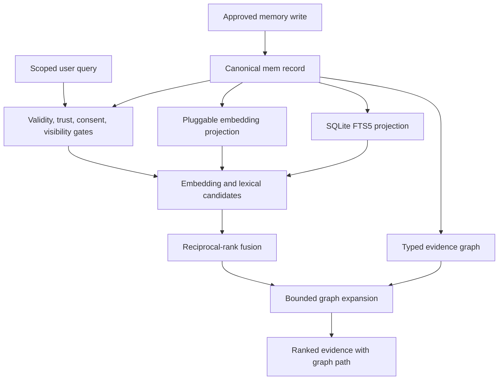

# Canonical Memory and Evidence Graph

Marven now has a deterministic graph projection over canonical SQLite memory. The canonical `mem` table remains the source of truth. Vector embeddings and graph nodes/edges are disposable retrieval structures that can be rebuilt without changing a memory record.

This is intentionally a graph-first implementation, not a graph neural network. It applies the useful part of GNN-style message passing described in Google's [Intro to graph neural networks](https://www.youtube.com/watch?v=8owQBFAHw7E&t=493s)—information flowing across connected nodes—through bounded, typed traversal that is inspectable before Marven learns graph weights from data.

## Runtime flow



The graph can propose related evidence. It cannot create, edit, confirm, supersede, or delete canonical memory.

## Canonical record

The existing `mem` table is migrated in place. Legacy rows are preserved and receive conservative defaults.

| Field | Purpose |
| --- | --- |
| `id` | Stable canonical memory ID |
| `workspace_id` / `owner_id` | Required logical identity boundary for every read and write |
| `agent_id` / `session_id` | Optional agent and conversation narrowing inside an owner boundary |
| `text` | Original approved memory value |
| `tags` | User- or system-approved index labels |
| `ts` | Creation timestamp |
| `subject` | Stable topic used for graph projection |
| `memory_type` | Episodic, preference, claim, conversation round, or another declared type |
| `source` / `source_locator` | Provenance and exact source reference |
| `valid_from` / `valid_to` | Validity interval for temporal retrieval |
| `confidence` | Admission confidence, not truth probability |
| `trust_status` | `confirmed`, `unverified`, `disputed`, or `rejected` |
| `consent_scope` | Scope under which the memory may be used |
| `visibility` | `private`, `shared`, or `public` |
| `episode_id` | Conversation or event grouping |
| `lineage` | Canonical IDs from which a record was derived |
| `supersedes` / `superseded_by` | Explicit knowledge-update chain |
| `deleted_at` | Tombstone used to propagate deletion to projections |
| `metadata` | Structured expansion fields such as entities, facts, keyphrases, and timestamped events |

Rejected, deleted, expired, future, and superseded records are excluded from normal retrieval. Historical retrieval can opt into superseded records and provide an `as_of` timestamp.

## Graph projection

The projection contains memory nodes plus stable concept nodes. It deliberately avoids copying full memory text into graph-node attributes.

| Canonical field | Node | Forward edge | Reverse edge |
| --- | --- | --- | --- |
| `subject` | Subject | `about` | `subject_of` |
| `tags` | Tag | `tagged_with` | `tag_for` |
| `episode_id` | Episode | `in_episode` | `episode_contains` |
| `metadata.entities` | Entity | `mentions` | `mentioned_by` |
| `source_locator` | Source | `from_source` | `source_contains` |
| `lineage` | Memory | `derived_from` | `source_for` |
| `supersedes` | Memory | `supersedes` | `superseded_by` |

Concept-node IDs are stable hashes of normalized values salted by workspace and owner. Identical entity or tag names therefore cannot join two owners' graph projections. Each edge includes the canonical ID and field that produced it, so retrieval paths remain explainable.

## Retrieval

`MemoryManager.search_evidence()` performs:

1. Hard filtering by workspace and owner, with optional agent and session narrowing.
2. Eligibility filtering against deletion, supersession, validity, trust, consent, and visibility.
3. Embedding and SQLite FTS5 candidate generation over the original value plus approved subject, tags, facts, keyphrases, timestamped events, and aliases.
4. Candidate union and reciprocal-rank fusion so lexical-only evidence is not discarded by the embedding stage.
5. At most two graph hops by default, with explicit edge allowlists and neighbor limits.
6. A bounded graph contribution to the fused score.
7. Return of the canonical record, component scores, provider identity, and best graph path.

The compatibility method `search()` returns the original tuple shape, while Marven's response path now enables hybrid retrieval and graph expansion by default. See [Scoped Hybrid Memory Retrieval](HYBRID_MEMORY_RETRIEVAL.md).

## LongMemEval lessons applied

[LongMemEval](https://github.com/xiaowu0162/LongMemEval) evaluates information extraction, multi-session reasoning, knowledge updates, temporal reasoning, and abstention. Its paper frames memory as indexing, retrieval, and reading, and reports gains from round-level values, fact-augmented keys, time-aware querying, and structured reading.

| LongMemEval finding | Implemented now | Next measurement |
| --- | --- | --- |
| Preserve enough value detail | Canonical text is retained; projections do not replace it with summaries | Compare round and session granularity |
| Use multiple retrieval keys | Text is indexed with approved subject, tags, facts, keyphrases, events, and aliases | Add learned late-interaction reranking |
| Support multi-session evidence | Graph paths connect memories through subjects, entities, tags, sources, and episodes; graded retrieval-label capture is implemented | Collect sufficient judgments, then measure Recall@k and NDCG by question type |
| Handle knowledge updates | Explicit supersession chains and validity intervals suppress stale records | Add contradiction proposals for human review |
| Make time first-class | Creation time, validity intervals, `as_of`, `time_start`, and `time_end` filters | Add natural-language time-range parsing |
| Test abstention | Missing, rejected, deleted, expired, and stale evidence is withheld | Add an evidence threshold and explicit unknown response policy |
| Improve reading, not only recall | Results include structured metadata and evidence paths | Evaluate Chain-of-Note-style reading locally |

Run the local retrieval adapter after obtaining the cleaned LongMemEval dataset:

```powershell
python scripts/evaluate_longmemeval_retrieval.py `
  data/longmemeval_s_cleaned.json `
  --granularity round `
  --mode both `
  --output reports/longmemeval-retrieval.json
```

The adapter does not download data or call an external model. It compares flat and graph-expanded retrieval using session-level Recall@k, Recall-all@k, and NDCG@k. Abstention items are reported separately because they have no evidence-session target.

## Local API

- `GET /api/memory/top?q=...&workspace_id=...&owner_id=...&graph=true&hops=2` returns scoped hybrid evidence and graph paths.
- `GET /api/memory/top?...&capture=plaintext` creates a labelable run; use
  `capture=hash-only` when raw query retention is not appropriate.
- `GET /api/memory/top?...&as_of=...&time_start=...&time_end=...` applies temporal scope.
- `GET /api/memory/graph?memory_id=...&workspace_id=...&owner_id=...&hops=2&limit=200` returns a bounded owner projection for inspection or a future Brain Tour view.
- `POST /api/memory/graph/rebuild` regenerates the graph from canonical records.
- `POST /api/memory/proposals` creates a scoped candidate that cannot affect retrieval until approved.
- `POST /api/memory/proposals/<id>/approve` or `/reject` records the admission decision.
- `/api/memory/retrieval/*` routes list, label, export, and delete scoped
  retrieval runs without duplicating canonical memory text.

The isolated [Graphiti evaluation](GRAPHITI_EVALUATION.md) uses these same
judgments to compare a temporal context graph with Marven's deterministic
baseline. Graphiti is not a GNN and cannot write back to canonical memory.

## When to add a GNN

The graph should become a GNN input only after Marven has:

1. A versioned graph schema and stable admission policy.
2. A sufficiently large, versioned set of labeled retrieval questions with
   evidence IDs, including LongMemEval-style update, temporal, privacy, and
   abstention cases. Label capture exists; collection and split design remain
   in progress.
3. Strong deterministic and vector baselines.
4. Train, validation, and test splits that prevent one user's private history from leaking across splits.
5. Evidence that learned node, edge, or path scoring improves recall and answer quality without increasing stale-memory or privacy failures.

A future GNN may rerank candidates, predict useful edges, or flag anomalies. Its outputs must remain proposals or scores. Canonical truth, consent, supersession, and deletion stay under deterministic governance.
